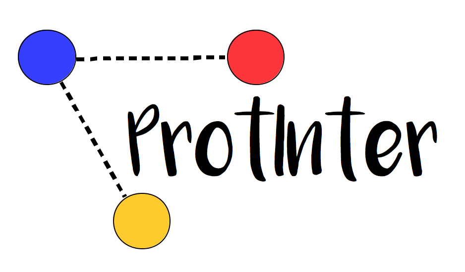

# ProtInter : Protein interaction calculator

**ProtInter** is a tool designed to calculate non-covalent interactions of a single chain protein in a `.pdb` file.

## Dependancies
- Python 3
- Biopython

## How to install

```c
git clone https://github.com/maxibor/protinter.git
cd proteininteraction
chmod +x protinter
```

## Example

```c
./protinter --hydrophobic -csv ./data/1bta.pdb  
```
The above example computes the hydrophobic interactions in `1BTA` and display the results, and writes them in the file `result_hydrophobic.csv`

## List of interactions available

- hydrophobic interactions
- disulphide interactions
- hydrogen bonds
- ionic interactions
- aromatic-aromatic interactions
- aromatic-sulphur interactions
- cation-pi interactions

Further informations on the interactions can be found [here](./doc/report.pdf)

## Get help

The help menu of **ProtInter** is accessible with the -h or --help flag.

```
protinter -h
usage: protinter [-h] [-csv] [-hydrophobic] [-disulphide] [-ionic] [-aroaro]
                 [-arosul] [-catpi] [-hb1] [-hb2] [-hb3] [-sep SEP] [-a A]
                 [-b B] [-c C] [-d D] [-e E] [-f F] [-g G] [-i I] [-j J]
                 file

Compute different interactions in protein stored in pdb files.

positional arguments:
  file          .pdb entry file

optional arguments:
  -h, --help    show this help message and exit
  -csv          save results in csv files
  -hydrophobic  compute hydrophobic interactions [a]
  -disulphide   compute disulphide bridges [b]
  -ionic        compute ionic interactions [c]
  -aroaro       compute aromatic-aromatic interactions [d] [e]
  -arosul       compute aromatic-sulphur interactions [f]
  -catpi        compute cation-pi interactions [g]
  -hb1          compute main chain-main chain H-bonds [i] [j]
  -hb2          compute main chain-side chain H-bonds [i] [j]
  -hb3          compute side chain-side chain H-bonds [i] [j]
  -sep SEP      minimum interval separation two AA for interaction. Default =
                0
  -a A          hydrophobic interactions max distance. Default = 5.0 Angstrom
  -b B          disulphide bridges max distance. Default = 2.2 Angstrom
  -c C          ionic interactions max distance. Default = 2.2 Angstrom
  -d D          aromatic-aromatic interactions min distance. Default = 4.5
                Angstrom
  -e E          aromatic-aromatic interactions max distance. Default = 7.0
                Angstrom
  -f F          aromatic-sulphur interactions max distance. Default = 5.3
                Angstrom
  -g G          cation-pi interactions max distance. Default = 6 Angstrom
  -i I          Donor-acceptor distance cutoff (N and O). Default = 3.5
                Angstrom
  -j J          Donor-acceptor distance cutoff (S). Default = 2.2 Angstrom
```
